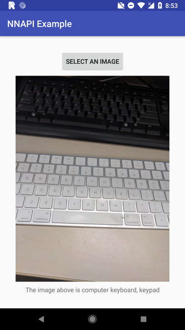

# DNNLibrary

[ ](https://bintray.com/daquexian566/maven/dnnlibrary/_latestVersion)


*Run neural network on your Android phone using the new NNAPI !*

Android 8.1 introduces Neural Networks API (NNAPI). It's very exciting to run a model in the "native" way supported by Android System. :)

DNNLirary is a wrapper of NNAPI ("DNNLibrary" is for "**d**aquexian's **NN**API library). It lets you easily make the use of the new NNAPI introduced in Android 8.1. You can convert your caffemodel into `daq` format by the [dnntools](https://github.com/daquexian/dnntools) and run the model directly. 

The demo consists `daq` model files for LeNet, ResNet-18 and SqueezeNet, and you can get your own model conveniently from pretrained caffemodel.

For how to use this lib directly in your project, check out [Usage](#usage) (it's at the bottom)

## Preparation

Please make sure the Android System on your phone is 8.1+, or you may want to use API 27 emulator. If you want to compile the demo please use Android Studio 3.0+, **the latest version(r17) of NDK is necessary**. 

## Screenshot

This screenshot is ResNet-18



This screenshot is LeNet


## Introduction

Android 8.1 introduces NNAPI. From my experient it is very efficient on my Pixel. For example, it takes [caffe-android-lib](https://github.com/sh1r0/caffe-android-lib) an average time of 43.42ms to do a convolution with 20 5\*5 filters on 224\*224 image, but it only takes 15.45ms for NNAPI -- about 1/3 of caffe-android-lib.

What's more, [depthwise convolution](https://arxiv.org/abs/1704.04861), which is useful on mobile devices, is optimized in NNAPI. It takes caffe-android-lib and NNAPI 82.32ms and 16.93ms respectively to do 5 * 5 depthwise conv on 224 \* 224 \* 20 input.

However, NNAPI is not friendly to normal Android developers. It is not designed to be used by normal developers directly. So I wrapped it into a library.

With DNNLibrary it's extremely easy to deploy your caffe model on Android 8.1+ phone. Here is my code to deploy the ResNet-18 on phone:

```
ModelWrapper.readFile(getAssets(), "resnet18");
ModelWrapper.setOutput("prob");
ModelWrapper.compile(ModelWrapper.PREFERENCE_FAST_SINGLE_ANSWER);

float[] result = ModelWrapper.predict(inputData);
```

Only four lines! And the model file is got from pretrained caffemodel by the [dnntools](https://github.com/daquexian/dnntools).

If you use the "raw" NNAPI, the code will increase dramatically. Setting up a LeNet needs 200+ lines. (For the 200+ lines LeNet you can check out the second commit of this repo)

## Usage

If you are an Android app developer and want it to work out of the box, it has been published on jcenter.

Add

```
implementation 'me.daquexian:dnnlibrary:0.2.5'
```

(for Gradle 3.0+),

or

```
compile 'me.daquexian:dnnlibrary:0.2.5'
```

(for Gradle lower than 3.0)

in your app's `build.gradle`'s `dependencies` section.

If you don't care about Android app and just want to do something in pure C++, for example, 
benchmark the speed of NNAPI, or just run a minimal binary on phone, the C++ project is under 
directory `dnnlibrary/cpp`, enter `dnnlibrary/cpp` and run cmake with `BUILD_BIN=ON` and 
`BUILD_JNI=OFF`, then build it, you will get binary files.
