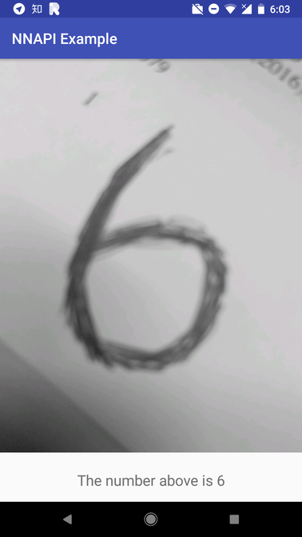

# DNNLibrary

[](https://travis-ci.com/daquexian/DNNLibrary)
[ ](https://bintray.com/daquexian566/maven/dnnlibrary/_latestVersion)


*Run ONNX models on your Android phone using the new NNAPI !*

Android 8.1 introduces Neural Networks API (NNAPI). It's very exciting to run a model in the "native" way supported by Android System. :)

DNNLibrary is a wrapper of NNAPI ("DNNLibrary" is for "**d**aquexian's **NN**API library). It lets you easily make the use of the new NNAPI introduced in Android 8.1. You can convert your onnx model into `daq` and run the model directly. 

For the Android app example, please check out [dnnlibrary-example](https://github.com/daquexian/dnnlibrary-example).

Telegram Group: [link](https://t.me/joinchat/DjMsYRBe0UtG6OZsYes5KQ), QQ Group (Chinese): 948989771, answer: 哈哈哈哈

## Screenshot

This screenshot is ResNet-18


This screenshot is LeNet



## Preparation

Clone this repo and submodules:

```bash
git clone --recursive https://github.com/daquexian/DNNLibrary
```

Please make sure the Android System on your phone is 8.1+, or you may want to use an 8.1+ emulator.

## Introduction

Android 8.1 introduces NNAPI. However, NNAPI is not friendly to normal Android developers. It is not designed to be used by normal developers directly. So I wrapped it into a library.

With DNNLibrary it's extremely easy to deploy your ONNX model on Android 8.1+ phone. For example, following is the Java code to deploy the MobileNet v2 in your app (please check out [dnnlibrary-example](https://github.com/daquexian/dnnlibrary-example) for detail):

```Java
ModelBuilder modelBuilder = new ModelBuilder();
Model model = modelBuilder.readFile(getAssets(), "mobilenetv2.daq")
                        // the following line will allow fp16 on supported devices, bringing speed boost. It is only available on Android P, see https://www.anandtech.com/show/13503/the-mate-20-mate-20-pro-review/4 for a detailed benchmark
                        // .allowFp16(true)
                        .setOutput("mobilenetv20_output_pred_fwd"); // The output name is from the onnx model
                        .compile(ModelBuilder.PREFERENCE_FAST_SINGLE_ANSWER);

float[] result = model.predict(inputData);
```

Only five lines! And the `daq` model file is got from the pretrained onnx model using `onnx2daq`.

## Convert the model

After cloning step listed in Preparation section, run
```bash
mkdir build
cd build
cmake ..
cmake --build .
```

Now `onnx2daq` is in `tools/onnx2daq` directory. The following command is to convert onnx model to daq model.

```bash
./tools/onnx2daq/onnx2daq onnx_model output_filename
```

For example, if you have a model named "mobilenetv2.onnx" in your current directory,
```bash
./tools/onnx2daq/onnx2daq mobilenetv2.onnx mobilenetv2.daq
```

## Usage

### If you are an Android app developer and want it to work out of the box

Welcome! It has been published on jcenter.

Add

```
implementation 'me.daquexian:dnnlibrary:0.6.2'
```

(for Gradle 3.0+),

or

```
compile 'me.daquexian:dnnlibrary:0.6.2'
```

(for Gradle lower than 3.0)

in your app's `build.gradle`'s `dependencies` section.

### If you don't care about Android app

We use CMake as the build system. So you can build it as most C++ projects, the only difference is that you need Android NDK, **r17b or higher NDK is necessary** :

```bash
mkdir build && cd build
cmake -DCMAKE_SYSTEM_NAME=Android -DCMAKE_ANDROID_NDK=path_of_android_ndk -DCMAKE_ANDROID_ARCH_ABI=arm64-v8a -DCMAKE_ANDROID_NDK_TOOLCHAIN_VERSION=clang -DCMAKE_ANDROID_STL_TYPE=c++_static -DCMAKE_SYSTEM_VERSION=Android_API_level(27_or_28) ..
cmake --build .
```

then you will get binary files.

## But TensorFlow Lite also supports NNAPI...

Yes, but its support for NNAPI is far from perfect. For example, dilated convolution (which is widely used in segmentation) are not supported (https://github.com/tensorflow/tensorflow/blob/da7b71f67147ff4795c5c0168d1f225ba2b4b522/tensorflow/lite/delegates/nnapi/nnapi_delegate.cc#L463), prelu is also not supported. 

What's more, only the models got from TensorFlow can easily get converted to TF Lite model. Since NNAPI is independent of any frameworks, we support ONNX, a framework-independent model format.

_ | TF Lite | DNNLibrary
--- |:---:|:---:
Supported Model Format | TensorFlow | ONNX
Dilated Convolution | ❌ | ✔️
Ease of Use | ❌ <br/>(Bazel build system,<br/>not friendly to Android developers) | ✔️ 
Quantization | ✔️ | ❌<br/>(WIP, plan to base on [this](https://github.com/BUG1989/caffe-int8-convert-tools))

However we are also far from maturity comparing to TF Lite. At least we are an another choice if you want to enjoy the power of NNAPI :)

## Benchmark

device | model | time
:---:|:---:|:---:
Google Pixel, API 28 | MobileNet v2 | 132.95ms
Google Pixel, API 28 | SqueezeNet v1.1 | 80.80ms
[RK3399](http://en.t-firefly.com/news/info/index/id/516.html), API 27 | MobileNet v2 | 59.90ms
RK3399, API 27 | SqueezeNet v1.1 | 51.10ms

More benchmark is welcome!

## About caffe model support

The old DNNLibrary supports caffe model by [dnntools](https://github.com/daquexian/dnntools), however, it is not supported directly now, the models generated by `dnntools` are not usable, too. Please use a convert tool like [MMdnn](https://github.com/Microsoft/MMdnn) to convert the caffe model to the ONNX model, then convert it to `daq` using `onnx2daq`.
