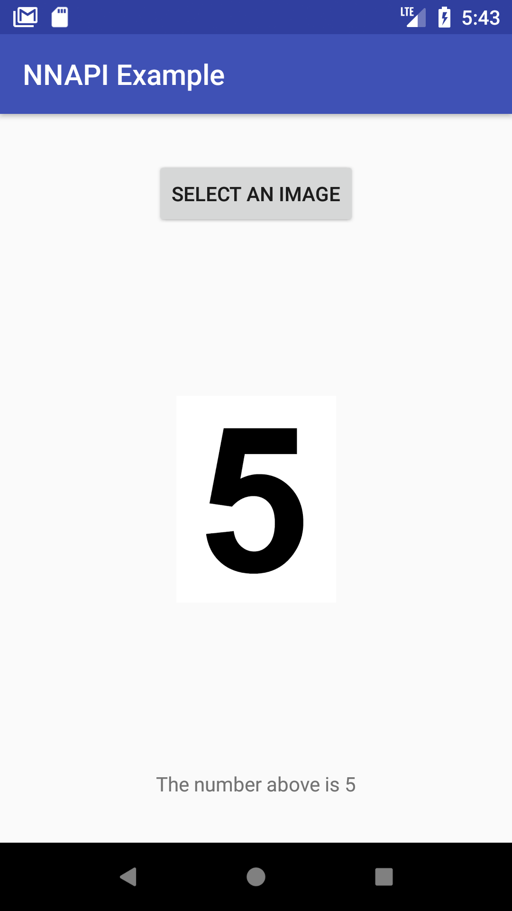

# NNAPI Example

*Run neural network on your Android phone using the new NNAPI !*

Android 8.1 introduces Neural Networks API (NNAPI). Though it is in beta, it's very exciting to run a model in the "native" way supported by Android System. :)

This project is a simple demo of NNAPI. It uses extracted weights of LeNet and recongnize a handwritten number. I extracted the pretrained weights using pycaffe and then changed the data layout according to the [document](https://developer.android.com/ndk/reference/group___neural_networks.html#gab95e96267e0f955086b87a743dad44ca).



## Preparation

Please make sure the Android System on your phone is 8.1+, or you may want to use API 27 emulator.

### Workaround for UnsatisfiedLinkError

You will get a `UnsatisfiedLinkError` about `ANeuralNetworksModel_identifyInputsAndOutputs` when you compile the project. It is a known bug. Please use the following workaround from [this](https://stackoverflow.com/questions/46987602/unsatisfiedlinkerror-on-aneuralnetworksmodel-identifyinputsandoutputs-in-nnapi-o):

In your NDK's android/NeuralNetworks.h, replace the declaration of `ANeuralNetworksModel_identifyInputsAndOutputs` by

```
__attribute__((weak))
extern "C" int ANeuralNetworksModel_setInputsAndOutputs(
        ANeuralNetworksModel* model,
        uint32_t inputCount, const uint32_t* inputs, uint32_t outputCount,
        const uint32_t* outputs);

extern "C" int ANeuralNetworksModel_identifyInputsAndOutputs(
        ANeuralNetworksModel* model,
        uint32_t inputCount, const uint32_t* inputs, uint32_t outputCount,
        const uint32_t* outputs) {

    return ANeuralNetworksModel_setInputsAndOutputs(
            model, inputCount, inputs, outputCount, outputs);
}
```

Please check out the stackoverflow post above for more details.


