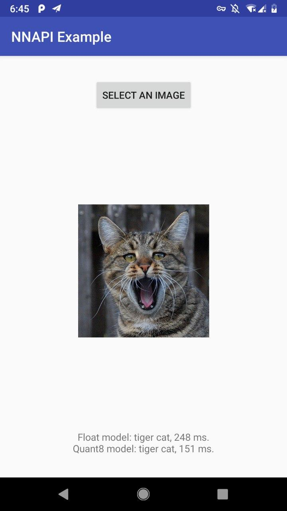
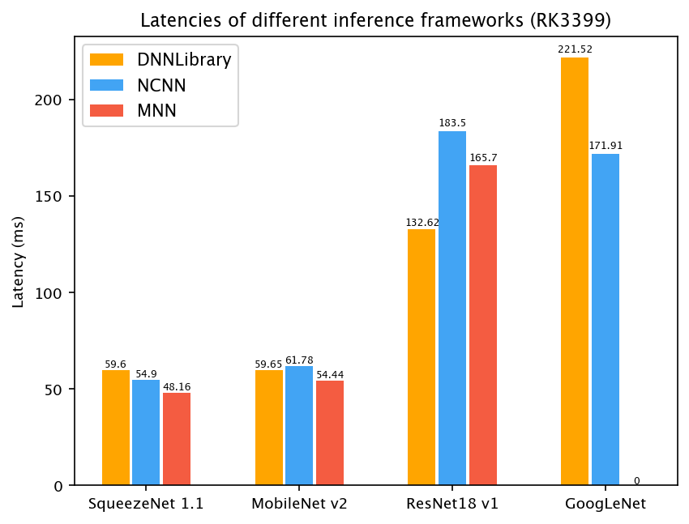
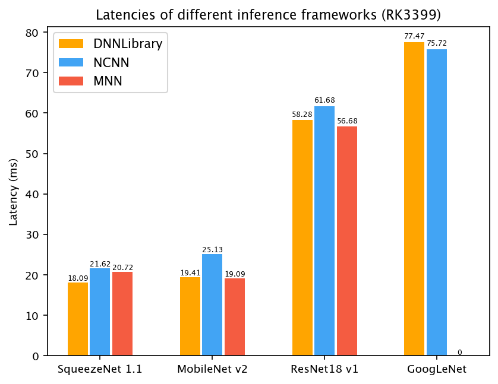
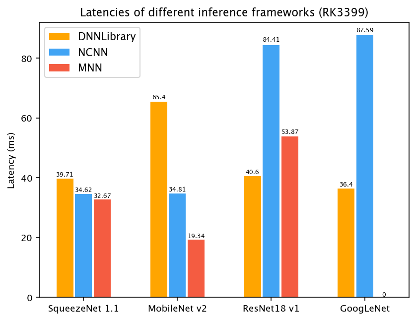

# DNNLibrary

[](https://dev.azure.com/daquexian/DNNLibrary/_build/latest?definitionId=8&branchName=master)
[ ](https://bintray.com/daquexian566/maven/dnnlibrary/_latestVersion)
[](https://github.com/JDAI-CV/DNNLibrary/pulls)

*Run ONNX models on your Android phone using the new NNAPI !*

Android 8.1 introduces Neural Networks API (NNAPI). It's very exciting to run a model in the "native" way supported by Android System. :)

DNNLibrary is a wrapper of NNAPI ("DNNLibrary" is for "**d**aquexian's **NN**API library). It lets you easily make the use of the new NNAPI introduced in Android 8.1. You can convert your onnx model into `daq` and run the model directly. 

For the Android app example, please check out [dnnlibrary-example](https://github.com/daquexian/dnnlibrary-example).

Telegram Group: [link](https://t.me/joinchat/DjMsYRBe0UtG6OZsYes5KQ), QQ Group (Chinese): 948989771, answer: 哈哈哈哈

## Screenshot

This screenshot is MobileNet v2, both float version and 8-bit quantized version



## Preparation

Please make sure the Android System on your phone is 8.1+, or you may want to use an 8.1+ emulator.

## Introduction

Android 8.1 introduces NNAPI. However, NNAPI is not friendly to normal Android developers. It is not designed to be used by normal developers directly. So I wrapped it into a library.

With DNNLibrary it's extremely easy to deploy your ONNX model on Android 8.1+ phone. For example, following is the Java code to deploy the MobileNet v2 in your app (please check out [dnnlibrary-example](https://github.com/daquexian/dnnlibrary-example) for detail):

```Java
ModelBuilder modelBuilder = new ModelBuilder();
Model model = modelBuilder.readFile(getAssets(), "mobilenetv2.daq")
                        // the following line will allow fp16 on supported devices, bringing speed boost. It is only available on Android P, see https://www.anandtech.com/show/13503/the-mate-20-mate-20-pro-review/4 for a detailed benchmark
                        // .allowFp16(true)
                        .setOutput("mobilenetv20_output_pred_fwd"); // The output name is from the onnx model
                        .compile(ModelBuilder.PREFERENCE_FAST_SINGLE_ANSWER);

float[] result = model.predict(inputData);
```

Only five lines! And the `daq` model file is got from the pretrained onnx model using `onnx2daq`.

## Convert the model

### If you are a Linux user

We provide precomplied AppImage of onnx2daq, our model conversion tool. [AppImage](https://appimage.org/) is a program format that runs on almost all Linux system. Just download the onnx2daq.AppImage from [releases](https://github.com/JDAI-CV/DNNLibrary/releases), and make it executable by

```bash
chmod +x onnx2daq.AppImage
```

then directly use it. The usage is in the following "Usage of onnx2daq".

### If you are a Windows or Mac user

You need to build onnx2daq from source.

Clone this repo and submodules:

```bash
git clone --recursive https://github.com/JDAI-CV/DNNLibrary
```

After cloning step listed in Preparation section, run
```bash
mkdir build
cd build
cmake ..
cmake --build .
```

Now `onnx2daq` is in `tools/onnx2daq` directory. 

### Usage of onnx2daq

```bash
path_of_onnx2daq onnx_model output_filename
```

For example, if you are a Linux user and have a model named "mobilenetv2.onnx" in your current directory,
```bash
./onnx2daq.AppImage mobilenetv2.onnx mobilenetv2.daq
```

For 8-bit quantization, please check out [our wiki](https://github.com/JDAI-CV/DNNLibrary/wiki/Quantization)

## Usage

### If you are an Android app developer and want it to work out of the box

Welcome! It has been published on jcenter.

Just add

```
implementation 'me.daquexian:dnnlibrary:replace_me_with_the_latest_version'
```

in your app's `build.gradle`'s `dependencies` section. 

The lastest version can be found in the following badge:

 

### If you are an c++ developer and don't care about Android app

We use CMake as the build system. So you can build it as most C++ projects, the only difference is that you need Android NDK, **r17b or higher NDK is necessary** :

```bash
mkdir build && cd build
cmake -DCMAKE_SYSTEM_NAME=Android -DCMAKE_TOOLCHAIN_FILE=path_of_android_ndk/build/cmake/android.toolchain.cmake -DANDROID_CPP_FEATURES=exceptions -DANDROID_PLATFORM=replace_me_with_android-28_or_android-27 -DANDROID_ABI=arm64-v8a 
cmake --build .
```

then you will get binary files.

## But TensorFlow Lite also supports NNAPI...

Yes, but its support for NNAPI is far from perfect. For example, dilated convolution (which is widely used in segmentation) are [not supported](https://github.com/tensorflow/tensorflow/blob/da7b71f67147ff4795c5c0168d1f225ba2b4b522/tensorflow/lite/delegates/nnapi/nnapi_delegate.cc#L463), prelu is also not supported. 

What's more, only the TensorFlow models can easily get converted to TensorFlow Lite model. Since NNAPI is independent of any frameworks, we support ONNX, a framework-independent model format.

_ | TF Lite | DNNLibrary
--- |:---:|:---:
Supported Model Format | TensorFlow | ONNX
Dilated Convolution | ❌ | ✔️
Ease of Use | ❌ <br/>(Bazel build system,<br/>not friendly to Android developers) | ✔️ 
Quantization | ✔️ | ✔️ <br/> (since 0.6.10)

However we are also far from maturity comparing to TF Lite. At least we are an another choice if you want to enjoy the power of NNAPI :)

## Benchmark

We benchmarked DNNLibrary against two popular frameworks, [NCNN](https://github.com/Tencent/ncnn) and [MNN](https://github.com/alibaba/MNN). DNNLibrary shows promising results on three devices. (Note: GoogleNet fails to convert on MNN so the corresponding latency is blank.)





More benchmark is welcome!

## About caffe model support

The old DNNLibrary supports caffe model by [dnntools](https://github.com/daquexian/dnntools), however, it is not supported directly now, the models generated by `dnntools` are not usable, too. Please use a convert tool like [MMdnn](https://github.com/Microsoft/MMdnn) to convert the caffe model to the ONNX model, then convert it to `daq` using `onnx2daq`.
